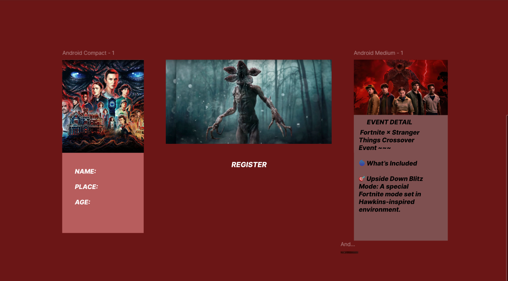

# Ex09 Event Registration Web Application
## Date:19/12/25

## AIM:
To design, develop and deploy a web application for event registration.

## DESIGN STEPS:

### Step 1:
Create a new frame.

### Step 2:
Select any one preset size of your choice.

### Step 3:
Select the shapes you need.

### Step 4:
Import images as needed.

### Step 5:
Create pages based on your need and link them.

### Step 6:

Validate the HTML and CSS code.

### Step 6:

Publish the website in the given URL.

## DESIGN TOOL:
Figma

## CODE:
index.html
<!DOCTYPE html>
<html>
  <head>
    <meta name="viewport" content="width=device-width, initial-scale=1" />
    <meta charset="utf-8" />
    <link rel="stylesheet" href="globals.css" />
    <link rel="stylesheet" href="style.css" />
  </head>
  <body>
    

      
      
      
NAME:  PLACE:  AGE:

    

  </body>
</html>

<!DOCTYPE html>
<html>
  <head>
    <meta name="viewport" content="width=device-width, initial-scale=1" />
    <meta charset="utf-8" />
    <link rel="stylesheet" href="globals.css" />
    <link rel="stylesheet" href="style.css" />
  </head>
  <body>
    

  </body>
</html>

<!DOCTYPE html>
<html>
  <head>
    <meta name="viewport" content="width=device-width, initial-scale=1" />
    <meta charset="utf-8" />
    <link rel="stylesheet" href="globals.css" />
    <link rel="stylesheet" href="style.css" />
  </head>
  <body>
    

      
EVENT DETAIL

      

        Fortnite × Stranger Things Crossover Event ~~~  🌀 What’s Included  🎯 Upside Down Blitz
        Mode: A special Fortnite mode set in Hawkins-inspired environment.
      

      
    

  </body>
</html>

## OUTPUT:

## RESULT:
The program to design, develop and deploy a web application for event registration is completed successfully.
